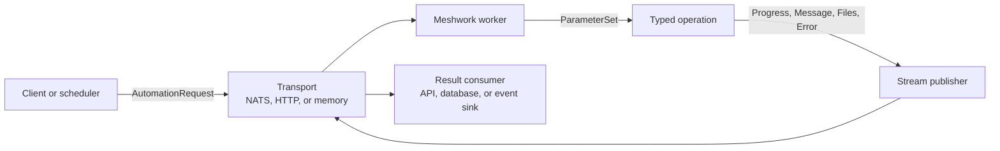

Meshwork
===

Library to connect a set of processes in a mesh configuration using
some form of network transparent bus. 

Used to issue automation requests to backend workers and capture their
output.

This library is still very specific to the automation for the
https://api.mythica.gg API backend.

Generalization work is underway to expose reusable core contracts separately
from Mythica-specific application behavior. Start with:

- `meshwork.core` for generic request, parameter, stream, protocol, and local
  execution APIs.
- `meshwork.transports` for NATS, REST compatibility, and in-memory transports.
- `meshwork.storage` for file resolution helpers.
- `meshwork.houdini` for Houdini-specific parameter/interface support.
- `meshwork.mythica` for the current Mythica compatibility layer.

Sample topology:



Minimal Python example:

```python
from meshwork import (
    AutomationRequest,
    Message,
    ParameterSet,
    Progress,
    StreamPublisher,
    operation,
    run_local,
)


class EchoRequest(ParameterSet):
    message: str


def echo(request: EchoRequest, publisher: StreamPublisher) -> Message:
    publisher.publish(Progress(progress=50))
    return Message(message=request.message)


echo_operation = operation("/echo", echo, EchoRequest, Message)
request = AutomationRequest.from_params(
    echo_operation.path,
    EchoRequest(message="hello mesh"),
)

result = run_local(echo, EchoRequest(**request.data))

print(result.result.message)
print([item.item_type for item in result.stream])
```

See:

- `docs/protocol.md`
- `docs/architecture.md`
- `docs/generalization-trajectory.md`
- `docs/migration-guide.md`
- `docs/examples.md`
- `docs/type-debt.md`
- `docs/development.md`
